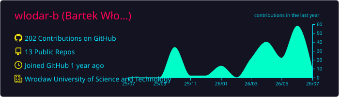

# Hi there, I'm Bartek! 👋
---

I am an **Information Technology and Automation Systems** student at Wrocław University of Science and Technology.

---
### 🛠️ Technical Toolbox

*   **Languages** C++, Python
*   **Networking & Security:** Cisco IOS, Wireshark, Network Protocols, Metasploit
---

### 🚀 Projects & Focus Areas

*   **CyberSecurity**

---

### 📫 Let's Connect!

*   **Location:** Wrocław / Częstochowa, Poland 🇵🇱

---

